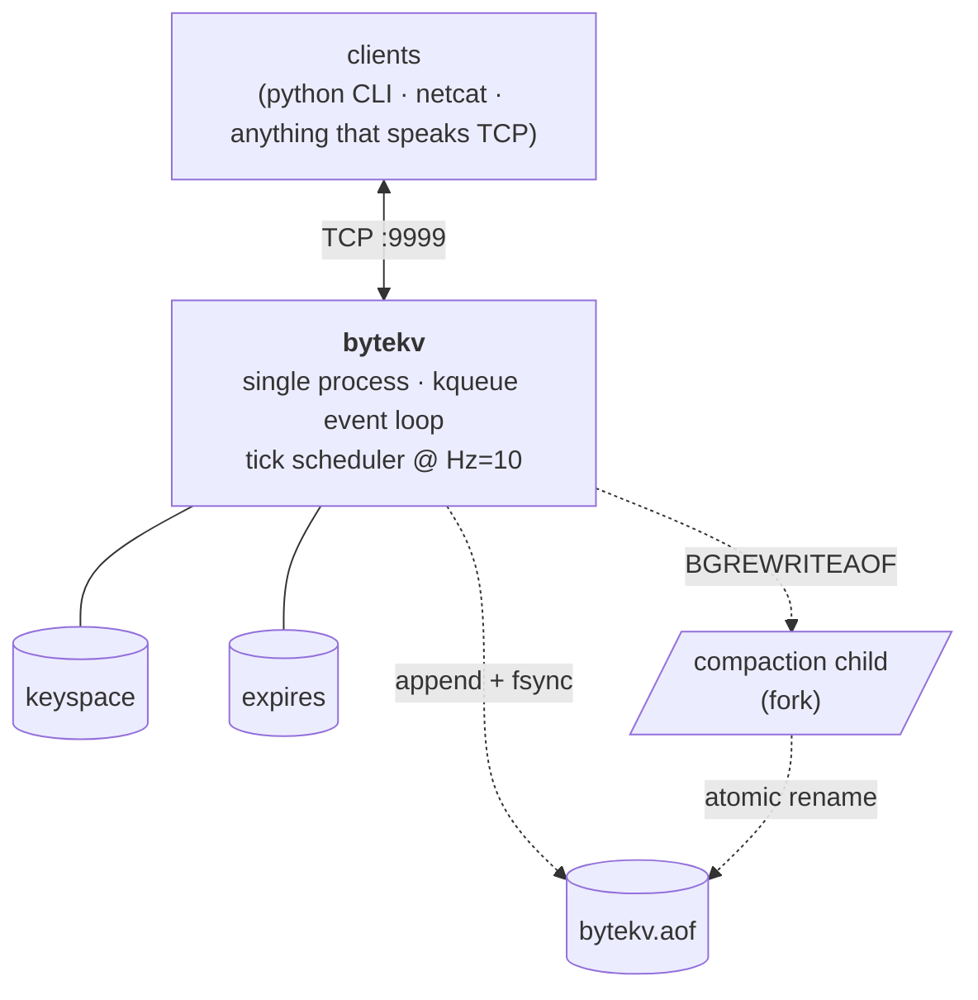
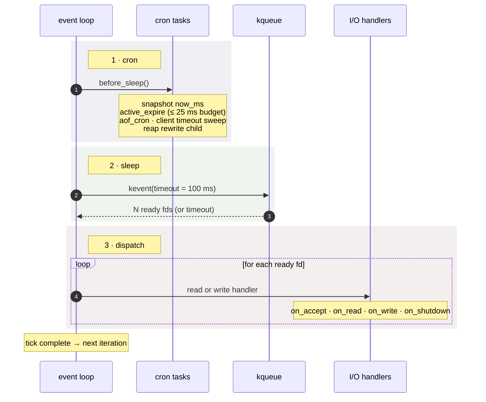
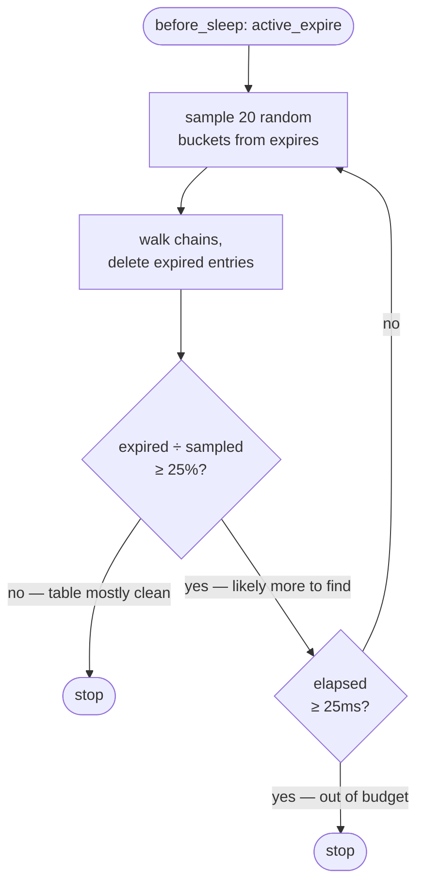
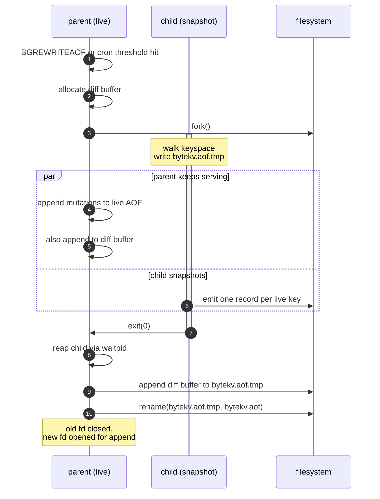

# bytekv

A single-threaded, event-loop-driven key-value store in C, modeled on the parts
of Redis I wanted to understand by writing them myself. Hash tables, lazy +
active expiration, length-prefixed TCP, and a fork-based AOF rewrite — all
from scratch, no dependencies beyond libc. ~2.7K lines.

## Demo

```
$ ./bytekv &
$ python3 client.py
bytekv> SET mood rebellious
+OK
bytekv> SETEX hype 5 "ai-will-replace-programmers"
+OK
bytekv> GET hype
+ai-will-replace-programmers
   (5 seconds later)
bytekv> GET hype
-ERR key not found
bytekv> INFO
+uptime:42 keys:1 expires:0 clients:1 aof_size:128 ...
```

Full command set in [the table below](#command-table).

## Architecture



Two hash tables: one for values, one for TTLs. Separating them is the
Redis-style trick that makes "keys without a TTL" cost nothing in the expiry
path — the sweep only walks the small table that contains keys with TTLs.

Networking knows nothing about storage. Storage knows nothing about TCP.
`command_execute()` is the only seam.

## One tick of the event loop

The server runs at `Hz=10` (configurable). Each tick has three phases — cron,
sleep, dispatch — repeated forever:



**Snapshot time, don't sample it.** `server.now_ms` is captured once per tick
in `before_sleep()`. Every command in the same tick sees the same timestamp.
`clock_gettime(CLOCK_MONOTONIC)` is cheap, but cheap times millions of
operations is not, and the consistency property (a `SET` and `EXPIRE` in the
same tick agree on "now") is worth more than the microseconds saved.

**Shutdown is a self-pipe trick.** A `SIGINT` handler writes one byte to a pipe
the event loop watches. The handler is async-signal-safe by being trivial; the
real shutdown logic runs on the main thread when `on_shutdown` reads the byte.
No `volatile sig_atomic_t` polling, no race between signal delivery and
`kevent` waking up.

## Wire protocol

Every TCP frame is length-prefixed:

```
┌──────────────┬───────────────────────────────────────┐
│  4B BE len   │  payload (ASCII command + args)       │
└──────────────┴───────────────────────────────────────┘
```

Max payload is 4 KiB (`MSG_MAX`). The command line is space-tokenized; the
command name is matched case-insensitively against a fixed table.

Responses are also framed. The body starts with `+` (success) or `-ERR`
(failure):

```
SET foo bar      →  +OK
GET foo          →  +bar
GET missing      →  -ERR key not found
SETEX x 10 y     →  +OK
TTL x            →  +9
```

### Command table

| Command | Arity | Persisted | Description |
|---|---:|:---:|---|
| `GET` | 2 | | Return value or error |
| `SET` | ≥3 | ✓ | Set key to value (value may contain spaces) |
| `SETEX` | 4 | ✓ | Set with TTL in seconds |
| `EXPIRE` | 3 | ✓ | Add TTL to an existing key |
| `PERSIST` | 2 | ✓ | Remove a TTL |
| `DEL` | 2 | ✓ | Delete key |
| `TTL` | 2 | | Remaining seconds, or `-2` / `-1` for missing / no-TTL |
| `KEYS` | 1 | | List all live keys |
| `INFO` | 1 | | Uptime, key counts, AOF stats |
| `BGREWRITEAOF` | 1 | | Trigger compaction in a forked child |

Arity is exact when positive; negative means "at least N args" (`SET` is `-3`,
the rest is value bytes). Persisted commands append a record to the AOF before
the response is sent.

## Storage and expiration

### Two hash tables

`db_t` holds two `ht_t` instances:

```
db_t
├── keyspace  (value_type = HT_VAL_STR)
│     "user"     → "alice"
│     "session"  → "abc123"
│     "counter"  → "42"
│
└── expires    (value_type = HT_VAL_I64)
      "session"  → 1713100800000   (CLOCK_MONOTONIC ms)
```

`"user"` and `"counter"` have no expiry entry — they live forever. The expiry
sweep only walks the `expires` table, which is bounded by the number of keys
that actually have a TTL.

Both tables use separate chaining, **djb2** hash, power-of-2 sizing, and grow
when `used / size > 0.75`. The growth strategy is a fresh `calloc` of the new
table followed by a full rehash — no incremental rehash, kept simple
deliberately (write paths during a grow are not a real concern at this scale).

### Two expiration strategies

**Lazy expiry** runs on every `GET` / `TTL`:

```
if expires[key] exists and now_ms > expire_at:
    delete from keyspace
    delete from expires
    return NULL
```

`O(1)` per access. Catches keys that are read. Misses keys nobody touches.

**Active expiry** runs in `before_sleep()` every tick, with a `25ms` budget
(1/4 of the tick at `Hz=10`). The algorithm is Redis's adaptive sweep:



If most sampled keys were live, the table is clean — stop early. If most were
expired, keep looping until either the table cools off or the budget is
exhausted. Best-effort by design: no SLO on when a key disappears, only that
under load the table doesn't grow unbounded.

## Persistence (AOF)

The append-only file is the durability story. Every mutating command appends a
binary record. On startup the file is replayed.

> **Crash guarantee.** With the default `always × full` settings, every
> command that returned `+OK` is on disk and survives a power loss. A torn
> write at the tail is detected by CRC and truncated cleanly. A corrupted file
> header fails fast at startup rather than loading garbage.

### Record layout

```
┌───────────┬──────────────┬────────┬─────────┬─────────┬───────────┬─────────────────┐
│ 8B CRC64  │ 4B body_len  │ 1B op  │ 2B klen │ 4B vlen │ 8B expire │ key + value     │
└───────────┴──────────────┴────────┴─────────┴─────────┴───────────┴─────────────────┘
└─── header (12 B) ───────┘└─────────────────────── body (body_len) ──────────────────┘
```

CRC64 covers `body_len` plus the entire body, including key and value. A torn
write at the tail of the file (process killed mid-`write`) is detected on
replay: the truncated record fails the CRC, and replay truncates the file at
the last valid record's end. No partial state leaks in.

The file itself starts with a 32-byte header (`BYTEKVAF` magic, version, flags,
created-ms, CRC) so a corrupted or wrong-version file fails fast at startup.

### fsync policy × fsync mode

Two orthogonal knobs, both in the config:

```
appendfsync = no | pertick | always
fsync-mode  = data | meta  | full
```

- **`no`** — append, never explicit fsync. Fastest, the OS decides when to
  flush. Up to ~30 s of writes can be lost on crash.
- **`pertick`** — one fsync per tick (~100 ms). Bounded loss, throughput stays
  high.
- **`always`** — fsync after every mutating command. No data loss on master
  crash; the syscall is the bottleneck.

The fsync *mode* controls how strong each flush is:

- **`data`** — `fdatasync(2)` on Linux (skip metadata), `fsync` elsewhere.
- **`meta`** — full `fsync(2)`.
- **`full`** — `F_FULLFSYNC` on macOS, which also flushes the SSD's internal
  DRAM cache to NAND. Strongest guarantee, ~10× slower on Apple silicon.

On a modern SSD, `full` is the only mode that survives a power loss exactly as
advertised. The default is `always` × `full` because the right default for a
database is "correct."

### AOF rewrite (compaction via fork)

The log grows monotonically — `SET k v; SET k v2; DEL k` writes three records
to describe a key that no longer exists. Compaction replaces the log with a
minimal snapshot of the live state. The trick comes from Redis: `fork(2)` gives
the child a copy-on-write snapshot, the parent keeps serving, and a diff buffer
absorbs the writes that happen during the snapshot.



Three states for the rewrite machine, recorded explicitly:

- `IDLE` — no child running. Cron may start one if `aof-rewrite-min-size` and
  `aof-rewrite-growth` thresholds are crossed.
- `ACTIVE` — child alive, diff buffer growing, finalize on `exit(0)`.
- `ABORTING` — diff buffer overflowed; signaled the child, on reap the temp
  file is discarded and the state returns to `IDLE`.

The rename is atomic on the same filesystem. If the parent crashes mid-rewrite,
the live `bytekv.aof` is untouched — the next startup just sees a stale temp
file (cleaned up on the way through).

## Design choices, and why

**Single-threaded, no locks.** Everything runs on one thread. There are no
mutexes anywhere in the codebase because there is no thread to race against.
This is what makes the data structures (hash tables, command dispatch, expiry)
trivially correct. The contended scenarios are all in I/O, where the kernel
handles serialization.

**Length-prefixed binary framing.** No delimiter parsing. No "the value
contains a newline" edge case. The frame size is in the header; the parser
either has a complete frame or it doesn't.

**Self-pipe trick for shutdown.** The `SIGINT` handler is async-signal-safe by
being a one-byte `write` to a pipe the event loop watches. All real teardown
runs on the main thread when `on_shutdown` reads the byte — no `volatile
sig_atomic_t` polling, no race between signal delivery and `kevent` waking up.

**djb2 hash, plain old `hash * 33 + c`.** Cheap, fast, no library dependency,
no special properties needed — the hash table only needs a uniform-enough
distribution over bucket indices.

**Power-of-2 table sizing, mask-not-modulo.** `index = hash & sizemask`
instead of `hash % size`. One bitwise AND instead of a divide. Requires the
size to always be a power of two, which is cheap to maintain by doubling on
grow.

**fork() for compaction, not threads.** The child gets a copy-on-write snapshot
of the parent's address space. The walk over the keyspace happens against a
frozen view, with no locks, no stop-the-world pause, no consistency drift. The
cost is duplicating the dirty pages the parent writes during compaction — fine
for a KV store, prohibitive for a database whose working set *is* its data.

**Diff buffer with a cap.** Bounded backpressure. If writes during compaction
exceed the diff buffer's cap, the rewrite aborts rather than blocking the
foreground. The next cron tick will retry.

## Module map

| File | Lines | Responsibility |
|---|---:|---|
| `networking.c` | 245 | Server bring-up and teardown: socket, kqueue, AOF replay, event-loop run, graceful shutdown. |
| `server.c` | 233 | Per-fd buffers, accept loop, frame parser, fast-path write, signal handlers, cron. |
| `event_loop.c` | 107 | kqueue wrapper. `el_add`, `el_run`, read/write handler dispatch. |
| `command.c` | 296 | Command table, arity check, tokenizer, per-command handlers. |
| `ht.c` | 201 | Hash table — djb2, separate chaining, power-of-2, resize at 0.75 load factor. |
| `db.c` | 109 | Two-hash-table keyspace. Lazy expiry on read, active sweep API. |
| `aof.c` | 696 | Append + replay + rewrite via fork. fsync policy and mode. CRC64 per record. |
| `crc64.c` | 183 | CRC-64-Jones (poly `0xad93d23594c935a9`), table ported from antirez/Redis. |
| `config.c` | 197 | INI-style config parser. Typed bounds, enum mapping for fsync modes / policies. |
| `util.c` | 81 | `set_non_blocking`, `now_ms`, `realtime_ms`. |
| `main.c` | 6 | `server_main(configfile)`. |

## Build & run

C17. POSIX. Tested on macOS (kqueue); Linux port is a small `event_loop.c`
swap to epoll.

```sh
make
./bytekv                    # uses defaults
./bytekv bytekv.conf        # explicit config file

# in another shell
python3 client.py           # interactive REPL
python3 client.py SET foo bar
python3 client.py GET foo
```

Built with `-Wall -Wextra -Werror -std=c17` and `-fsanitize=undefined` on by
default.

Settings of note in `bytekv.conf`:

```
port 9999
hz 10
appendfsync always           # no | pertick | always
fsync-mode  full             # data | meta | full
aof-rewrite-min-size 1048576 # trigger compaction past 1 MB
aof-rewrite-growth   100     # ...and 100% larger than the last rewrite
active-expire-enabled yes
client-timeout 300
```

## Out of scope

- **Clustering, replication, Sentinel.** Single node. No master/replica.
- **RESP2/RESP3 protocol.** Custom length-prefixed framing; not wire-compatible
  with `redis-cli`. The Python client speaks the protocol.
- **Pipelining / batching.** One frame in, one frame out. The framing supports
  it; the parser doesn't yet.
- **Pub/sub, streams, scripting, modules.** Just the KV core.
- **Threaded I/O.** Redis 6+ has it; we don't.
- **Multi-key transactions (`MULTI`/`EXEC`).** No transactional API.

## References

- Salvatore Sanfilippo, *Redis source code* (early versions especially). The
  single-threaded-with-cron architecture, the two-table keyspace, the
  fork-based `BGREWRITEAOF`, and the adaptive expiry sweep are all directly
  inspired by reading it.
- *The Linux Programming Interface*, Michael Kerrisk. For everything about
  signals, the self-pipe trick, fork semantics, and fsync flavors.
- BSD man pages for `kqueue(2)`, `kevent(2)`, `fcntl(2) F_FULLFSYNC`.
